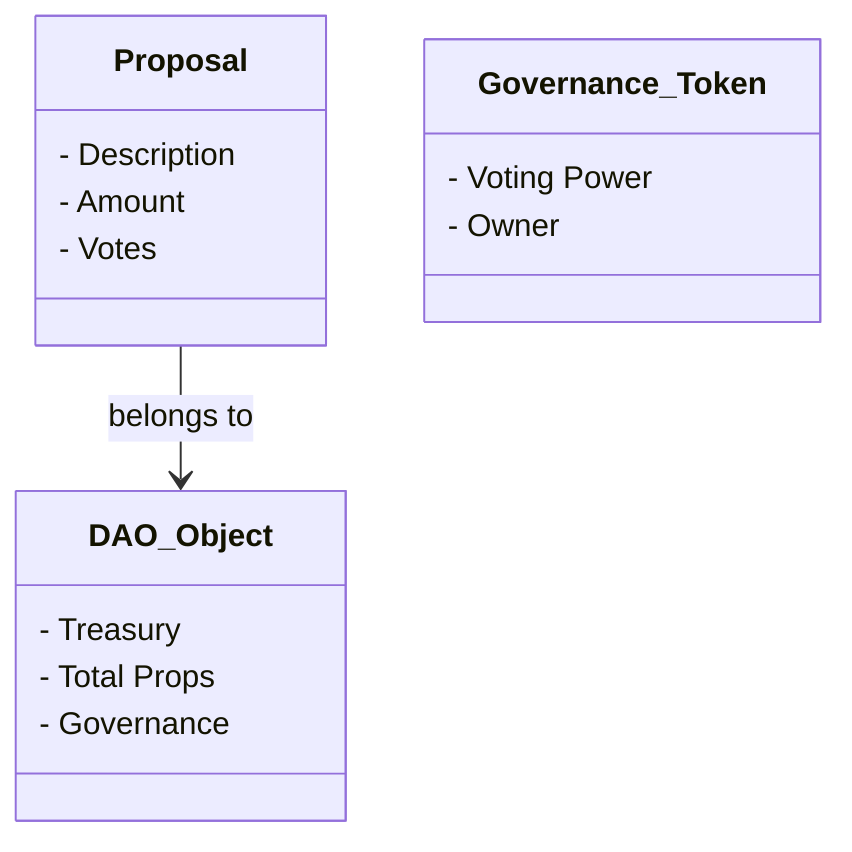

# 🏛️ DAO de Financiamiento Sui

> **Proyecto de certificación Sui Developer Program**  
> Una organización autónoma descentralizada para financiar proyectos comunitarios

[](https://sui.io/)
[](https://move-language.github.io/)
[](https://opensource.org/licenses/MIT)

## 📖 Descripción

Esta DAO permite a una comunidad decidir democráticamente qué proyectos financiar usando tokens de gobernanza y votación transparente en la blockchain de Sui. Los miembros pueden:

- 📝 **Proponer proyectos** que necesiten financiamiento
- 🗳️ **Votar** con tokens de gobernanza
- 💰 **Recibir fondos** automáticamente si la propuesta es aprobada
- 👀 **Transparencia total** de todas las decisiones

## 🚀 Estado del Proyecto

- [x] Conceptualización y diseño
- [ ] Implementación del contrato Move
- [ ] Testing y validación
- [ ] Despliegue en testnet
- [ ] Despliegue en mainnet
- [ ] Documentación final

## 🛠️ Tecnologías

- **Blockchain:** Sui Network
- **Lenguaje:** Move
- **Herramientas:** Sui CLI, Move Analyzer

## 📚 Documentación

- [📖 **Notas de Aprendizaje**](./learning-notes/README.md) - Todo el proceso de estudio de Move y Sui
- [📋 **Documentación Técnica**](./docs/) - Especificaciones y guías del proyecto
- [💡 **Ejemplos de Uso**](./examples/) - Cómo interactuar con la DAO

## 🏗️ Arquitectura



## 🎯 Funcionalidades Principales

1. **Crear DAO** - Inicializar organización con tesorería
2. **Generar Propuestas** - Solicitar financiamiento para proyectos
3. **Sistema de Votación** - Votar con tokens de gobernanza
4. **Ejecutar Propuestas** - Distribución automática de fondos aprobados
5. **Gestión de Tokens** - Distribución de poder de voto

## 🚀 Instalación y Uso

### Prerequisitos
```bash
# Instalar Sui CLI
curl -fLsS https://sui.io/install.sh | sh

# Verificar instalación
sui --version
```

### Clonar y compilar
```bash
git clone https://github.com/tu-usuario/sui-dao-financing.git
cd sui-dao-financing/contracts
sui move build
```

### Testing
```bash
sui move test
```

### Despliegue
```bash
# Ver guía completa en deployment/
sui client publish --gas-budget 20000000
```

## 📝 Ejemplos de Uso

```bash
# Crear nueva DAO
sui client call --package $PACKAGE_ID --module dao --function create_dao

# Crear propuesta
sui client call --package $PACKAGE_ID --module dao --function create_proposal \
  --args "Mi Proyecto" "Descripción detallada" 1000000000

# Votar en propuesta
sui client call --package $PACKAGE_ID --module dao --function cast_vote \
  --args $PROPOSAL_ID true $GOVERNANCE_TOKEN
```

## 🤝 Contribuir

Este proyecto es parte del Sui Developer Program. Las contribuciones son bienvenidas:

1. Fork el repositorio
2. Crea una branch feature (`git checkout -b feature/AmazingFeature`)
3. Commit tus cambios (`git commit -m 'Add AmazingFeature'`)
4. Push a la branch (`git push origin feature/AmazingFeature`)
5. Abre un Pull Request

## 📄 Licencia

Distribuido bajo la Licencia MIT. Ver `LICENSE` para más información.

## 👨‍💻 Autor

**Tu Nombre**
- GitHub: [@David-Coach-Dev](https://github.com/David-Coach-Dev)
- Discord: tu-usuario#1234
- Proyecto: [Sui Developer Program](https://sui.io/developers)

## 🔗 Enlaces Útiles

- [Sui Documentation](https://docs.sui.io/)
- [Move Book](https://move-book.com/)
- [Sui Developer Program](https://sui.io/developers)
- [Move Registry](https://www.moveregistry.com/)

---

**⭐ Si te gusta este proyecto, dale una estrella en GitHub!**
