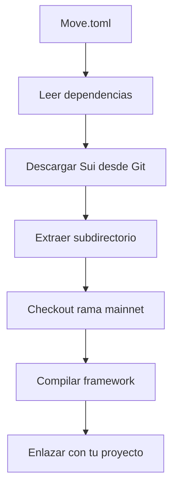

# 📄 Explicación Completa del Archivo Move.toml

## 🏗️ **¿QUÉ ES EL ARCHIVO Move.toml?**

El archivo `Move.toml` es el **archivo de configuración principal** de cualquier proyecto en Move. Es equivalente al `package.json` en Node.js o `Cargo.toml` en Rust. Define la **identidad del proyecto**, sus **dependencias** y **configuraciones** necesarias para compilar y ejecutar.

---

## 📋 **CONTENIDO ACTUAL DEL ARCHIVO**

```toml
[package]
name = "dao_financing"
version = "1.0.0"
edition = "2024.beta"

[dependencies]
Sui = { git = "https://github.com/MystenLabs/sui.git", subdir = "crates/sui-framework/packages/sui-framework", rev = "framework/mainnet" }

[addresses]
dao_financing = "0x0"
```

---

## 📦 **1. SECCIÓN [package] - METADATOS DEL PROYECTO**

### ** Línea 1: Encabezado de Sección**
```toml
[package]
```

**🔍 Explicación:**
- **`[package]`** = Declara el inicio de la sección de metadatos del paquete
- **Sección obligatoria** en todo proyecto Move
- Los **corchetes** `[]` indican una nueva sección en archivos TOML
- Define **información básica** del proyecto

### **🔸 Línea 2: Nombre del Proyecto**
```toml
name = "dao_financing"
```

**🔍 Explicación:**
- **`name`** = Campo obligatorio que identifica únicamente tu proyecto
- **`"dao_financing"`** = Nombre específico de tu DAO
- **Reglas de nomenclatura**:
  - Solo letras minúsculas, números y guiones bajos
  - Debe coincidir con el nombre del módulo principal
  - Único dentro del ecosistema de Sui

**📝 Uso en código:**
```move
module dao_financing::dao {  // El nombre aquí debe coincidir
    // Tu código...
}
```

**📝 Uso en imports:**
```move
use dao_financing::dao;  // Otros proyectos pueden importar así
```

### **🔸 Línea 3: Versión del Proyecto**
```toml
version = "1.0.0"
```

**🔍 Explicación:**
- **`version`** = Versión actual de tu proyecto
- **`"1.0.0"`** = Formato de **versionado semántico** (SemVer)
- **Estructura**: `MAYOR.MENOR.PARCHE`
  - **MAYOR (1)**: Cambios incompatibles
  - **MENOR (0)**: Nuevas funcionalidades compatibles
  - **PARCHE (0)**: Correcciones de bugs

**📊 Ejemplos de versionado:**
```toml
version = "0.1.0"    # Versión inicial de desarrollo
version = "1.0.0"    # Primera versión estable
version = "1.1.0"    # Nueva funcionalidad añadida
version = "1.1.1"    # Corrección de bug
version = "2.0.0"    # Cambio que rompe compatibilidad
```

### **🔸 Línea 4: Edición del Lenguaje**
```toml
edition = "2024.beta"
```

**🔍 Explicación:**
- **`edition`** = Versión del lenguaje Move que utilizas
- **`"2024.beta"`** = Edición más reciente con características avanzadas
- **Controla**:
  - Sintaxis disponible
  - Características del lenguaje
  - Validaciones del compilador
  - Compatibilidad con el runtime

**📋 Ediciones disponibles:**
```toml
edition = "legacy"     # Versión original (deprecated)
edition = "2024.alpha" # Versión experimental
edition = "2024.beta"  # Versión estable actual (recomendada)
```

**🆕 Características de 2024.beta:**
- **Structs públicas** requieren palabra clave `public`
- **Variables mutables** explícitas con `mut`
- **Mejor sistema de tipos**
- **Validaciones mejoradas**

---

## 🔗 **2. SECCIÓN [dependencies] - DEPENDENCIAS EXTERNAS**

### **🔸 Línea 6: Encabezado de Dependencias**
```toml
[dependencies]
```

**🔍 Explicación:**
- **`[dependencies]`** = Sección que lista las librerías externas necesarias
- **Obligatoria** para proyectos que usan código de terceros
- Define **qué código** puede importar tu proyecto
- Equivalente a `dependencies` en `package.json`

### **🔸 Línea 7: Dependencia de Sui Framework**
```toml
Sui = { git = "https://github.com/MystenLabs/sui.git", subdir = "crates/sui-framework/packages/sui-framework", rev = "framework/mainnet" }
```

**🔍 Desglose detallado:**

#### **📍 Nombre de la Dependencia:**
```toml
Sui = { ... }
```
- **`Sui`** = Alias que usarás en tus imports
- **Ejemplo de uso**: `use sui::object;`

#### **📦 Fuente Git:**
```toml
git = "https://github.com/MystenLabs/sui.git"
```
- **`git`** = Especifica que la dependencia viene de un repositorio Git
- **URL**: Repositorio oficial de Sui Network
- **Alternativas**:
  ```toml
  # Para dependencias locales
  local = "../path/to/local/package"
  
  # Para dependencias publicadas (futuro)
  registry = "https://registry.sui.io"
  ```

#### **📁 Subdirectorio:**
```toml
subdir = "crates/sui-framework/packages/sui-framework"
```
- **`subdir`** = Carpeta específica dentro del repositorio
- **Ruta completa**: Donde está el código del framework
- **Por qué necesario**: El repo de Sui contiene múltiples paquetes

**🗂️ Estructura del repo de Sui:**
```
sui/
├── crates/
│   ├── sui-framework/
│   │   ├── packages/
│   │   │   ├── sui-framework/     ← Aquí está el código
│   │   │   ├── sui-system/
│   │   │   └── move-stdlib/
│   │   └── ...
│   └── ...
└── ...
```

#### **🏷️ Revisión/Versión:**
```toml
rev = "framework/mainnet"
```
- **`rev`** = Versión específica del código a usar
- **`"framework/mainnet"`** = Rama de producción estable
- **Alternativas**:
  ```toml
  rev = "main"                    # Rama principal (puede ser inestable)
  rev = "devnet"                  # Versión para red de desarrollo
  rev = "testnet"                 # Versión para red de pruebas
  rev = "abc123..."               # Commit específico (más estable)
  ```

**🎯 ¿Por qué mainnet?**
- **Estabilidad**: Código probado en producción
- **Compatibilidad**: Funciona con la red principal
- **Seguridad**: Sin características experimentales

---

## 🏠 **3. SECCIÓN [addresses] - DIRECCIONES DEL PROYECTO**

### **🔸 Línea 9: Encabezado de Direcciones**
```toml
[addresses]
```

**🔍 Explicación:**
- **`[addresses]`** = Define alias para direcciones de blockchain
- **Simplifica** el uso de direcciones largas y complejas
- **Permite** cambiar direcciones fácilmente entre entornos

### **🔸 Línea 10: Dirección Principal**
```toml
dao_financing = "0x0"
```

**🔍 Explicación detallada:**

#### **🏷️ Alias:**
```toml
dao_financing = "..."
```
- **`dao_financing`** = Nombre corto para tu dirección
- **Debe coincidir** con el nombre del paquete
- **Se usa** en la declaración del módulo

#### **📍 Dirección:**
```toml
"0x0"
```
- **`"0x0"`** = Dirección placeholder temporal
- **Formato**: Hexadecimal con prefijo `0x`
- **En producción** será algo como: `"0x123abc456def..."`

**📝 Uso en código:**
```move
module dao_financing::dao {  // Usa el alias aquí
    // dao_financing se resuelve a la dirección configurada
}
```

**🔄 Diferentes entornos:**
```toml
# Desarrollo local
dao_financing = "0x0"

# Red de pruebas
dao_financing = "0x123abc456def789..."

# Red principal
dao_financing = "0x987fed654cba321..."
```

---

## 🚫 **CAMPOS REMOVIDOS (ANTERIORMENTE PROBLEMÁTICOS)**

### **❌ Campos No Válidos en Move.toml:**

```toml
# ❌ REMOVIDO - No reconocido en Move.toml
description = "Decentralized Autonomous Organization for project financing on Sui Network"
authors = ["Tu Nombre <tu@email.com>"]
license = "MIT"
repository = "https://github.com/tu-usuario/sui-dao-financing"
```

**🔍 Explicación:**
- Estos campos son **válidos en Cargo.toml** (Rust) pero **NO en Move.toml**
- **Causaban errores** de compilación
- **Move.toml** tiene su propio conjunto de campos válidos

### **❌ Sección Duplicada Removida:**

```toml
# ❌ REMOVIDO - Causaba conflicto
[dev-addresses]
dao_financing = "0x0"
```

**🔍 Explicación:**
- **Dirección duplicada** entre `[addresses]` y `[dev-addresses]`
- **Causaba conflictos** durante compilación
- **No necesario** para proyectos simples

### **❌ Sección Vacía Removida:**

```toml
# ❌ REMOVIDO - Sección innecesaria
[dev-dependencies]
```

**🔍 Explicación:**
- **Sección vacía** sin propósito
- **Move.toml** debe ser **mínimo y funcional**

---

## 🔧 **FUNCIONAMIENTO INTERNO**

### **🔄 Proceso de Compilación:**

1. **Lectura**: El compilador lee `Move.toml`
2. **Validación**: Verifica que todos los campos sean válidos
3. **Resolución**: Descarga dependencias desde Git
4. **Mapeado**: Asigna direcciones a aliases
5. **Compilación**: Compila el proyecto con dependencias

### **📥 Resolución de Dependencias:**



### **🏷️ Resolución de Direcciones:**

```move
// En Move.toml:
// dao_financing = "0x0"

module dao_financing::dao {  // Se resuelve como:
    // module 0x0::dao {
}
```

---

## 🎯 **CONFIGURACIONES ALTERNATIVAS**

### **🧪 Para Desarrollo:**

```toml
[package]
name = "dao_financing"
version = "0.1.0"                    # Versión de desarrollo
edition = "2024.beta"

[dependencies]
Sui = { git = "https://github.com/MystenLabs/sui.git", subdir = "crates/sui-framework/packages/sui-framework", rev = "devnet" }

[addresses]
dao_financing = "0x0"

[dev-addresses]                      # Para tests locales
dao_financing = "0x123"
```

### **🚀 Para Producción:**

```toml
[package]
name = "dao_financing"
version = "1.0.0"                    # Versión estable
edition = "2024.beta"

[dependencies]
Sui = { git = "https://github.com/MystenLabs/sui.git", subdir = "crates/sui-framework/packages/sui-framework", rev = "framework/mainnet" }

[addresses]
dao_financing = "0x987fed654cba321..." # Dirección real
```

### **📚 Con Múltiples Dependencias:**

```toml
[package]
name = "dao_financing"
version = "1.0.0"
edition = "2024.beta"

[dependencies]
Sui = { git = "https://github.com/MystenLabs/sui.git", subdir = "crates/sui-framework/packages/sui-framework", rev = "framework/mainnet" }
MoveStdlib = { git = "https://github.com/MystenLabs/sui.git", subdir = "crates/sui-framework/packages/move-stdlib", rev = "framework/mainnet" }

[addresses]
dao_financing = "0x0"
std = "0x1"                          # Dirección estándar
sui = "0x2"                          # Dirección del framework
```

---

## ✅ **VALIDACIONES Y BUENAS PRÁCTICAS**

### **🔍 Validaciones del Compilador:**

- **Nombre único** en el ecosistema
- **Versión válida** en formato semántico
- **Edición existente** y compatible
- **Dependencias accesibles** y válidas
- **Direcciones únicas** sin conflictos

### **🎯 Buenas Prácticas:**

#### **📝 Nomenclatura:**
```toml
# ✅ BIEN
name = "dao_financing"
name = "my_token"
name = "nft_marketplace"

# ❌ MAL
name = "DAO-Financing"         # Guiones no permitidos
name = "MyProject"             # Mayúsculas no recomendadas
name = "123project"            # No debe empezar con número
```

#### **📊 Versionado:**
```toml
# ✅ BIEN - Progresión lógica
version = "0.1.0"  # Primera versión
version = "0.2.0"  # Nueva funcionalidad
version = "1.0.0"  # Primera versión estable
version = "1.0.1"  # Corrección de bugs

# ❌ MAL
version = "1.0"      # Formato incompleto
version = "v1.0.0"   # Prefijo innecesario
```

#### **🏷️ Direcciones:**
```toml
# ✅ BIEN
dao_financing = "0x0"                    # Desarrollo
dao_financing = "0x123abc456def..."      # Producción

# ❌ MAL
dao_financing = "123abc"                 # Sin prefijo 0x
dao_financing = "0xGHI..."               # Caracteres inválidos
```

---

## 🚨 **PROBLEMAS COMUNES Y SOLUCIONES**

### **❌ Error: "Unknown field"**
```bash
error: unknown field `description`
```
**🔧 Solución:** Remover campos no válidos como `description`, `authors`, etc.

### **❌ Error: "Duplicate address"**
```bash
error: duplicate address assignment for `dao_financing`
```
**🔧 Solución:** Usar solo `[addresses]` o `[dev-addresses]`, no ambos.

### **❌ Error: "Failed to resolve dependency"**
```bash
error: failed to resolve dependency `Sui`
```
**🔧 Solución:** Verificar conectividad a internet y URL del repositorio.

### **❌ Error: "Invalid package name"**
```bash
error: invalid package name `DAO-Financing`
```
**🔧 Solución:** Usar solo letras minúsculas y guiones bajos.

---

## 🎯 **RESUMEN EJECUTIVO**

### **✅ Tu Configuración Actual:**
- **✅ Mínima y funcional** - Solo lo esencial
- **✅ Sin errores** - Campos válidos únicamente
- **✅ Estable** - Usa versión mainnet de Sui
- **✅ Compatible** - Edición 2024.beta

### **🎯 Propósito de Cada Sección:**
- **`[package]`** → Identifica tu proyecto
- **`[dependencies]`** → Importa framework de Sui
- **`[addresses]`** → Define dónde vive tu código

### **🔧 Flujo de Trabajo:**
1. **Desarrollo**: Usar dirección `0x0`
2. **Deploy**: Cambiar a dirección real
3. **Testing**: Compilar y probar
4. **Producción**: Usar versión mainnet

### **💡 Beneficios de esta Configuración:**
- **Compilación rápida** sin dependencias innecesarias
- **Compatibilidad total** con Sui Network
- **Fácil mantenimiento** con configuración limpia
- **Sin warnings** ni errores de configuración

Esta configuración de `Move.toml` proporciona una base sólida y funcional para el desarrollo de tu DAO en Sui Network, manteniéndose simple pero completa para todas las necesidades del proyecto.