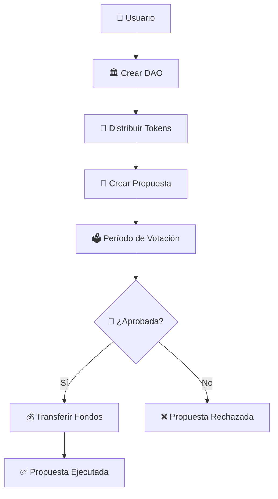

# 🏛️ Project Overview - DAO de Financiamiento Sui

> **Resumen ejecutivo del proyecto desarrollado para el Sui Developer Program**

## 📖 **¿Qué es este proyecto?**

Una **Organización Autónoma Descentralizada (DAO)** construida en Sui Network que permite a una comunidad decidir democráticamente qué proyectos financiar usando tokens de gobernanza y votación transparente en blockchain.

### 🎯 **Problema que Resuelve**
- **Financiamiento tradicional es centralizado** → La DAO democratiza las decisiones
- **Falta de transparencia en fondos** → Todo queda registrado en blockchain
- **Procesos burocráticos lentos** → Ejecución automática de decisiones aprobadas
- **Barreras de entrada altas** → Cualquiera puede participar con tokens

---

## ⚡ **Características Principales**

### 🗳️ **Sistema de Gobernanza Democrática**
- Los miembros votan con tokens de gobernanza
- Una persona = un token = un voto (configurable)
- Votación por mayoría simple
- Transparencia total de resultados

### 💰 **Gestión Automática de Tesorería**
- Fondos almacenados de forma segura en blockchain
- Distribución automática cuando propuesta es aprobada
- Sin intermediarios o administradores centrales
- Auditable públicamente en todo momento

### 📝 **Propuestas Abiertas**
- Cualquier miembro puede proponer proyectos
- Descripción detallada y monto solicitado
- Sistema de estados (Activa, Aprobada, Ejecutada)
- Historial completo de propuestas

### 🔒 **Seguridad y Validaciones**
- Prevención de votos duplicados
- Verificación de fondos suficientes
- Validaciones de ownership de tokens
- Código auditado y verificable

---

## 🏗️ **Arquitectura Técnica**

### 📦 **Componentes Principales**

```
🏛️ DAO (Objeto Compartido)
├── 💰 Treasury (Balance<SUI>)
├── 📊 Proposal Counter  
├── ⚙️ Min Voting Power
└── 🔘 Active Status

📝 Proposal (Objeto Compartido)
├── 📋 Title & Description
├── 💵 Amount Requested
├── 👤 Proposer Address
├── 📊 Vote Counters
└── 🏷️ Status

🎫 Governance Token (Objeto Personal)
├── 🆔 DAO Reference
├── ⚡ Voting Power
└── 👤 Owner (implícito)

🗳️ Vote (Campo Dinámico)
├── ✅ Support (true/false)
├── ⚡ Voting Power
└── ⏰ Timestamp
```

### 🔄 **Flujo de Operación**



---

## 👥 **Casos de Uso**

### 🌟 **Caso 1: Comunidad de Desarrolladores**
**Escenario:** Grupo de desarrolladores quiere financiar proyectos open source
- Crean DAO con 1000 SUI de treasury
- Distribuyen tokens basados en contribuciones pasadas
- Miembros proponen librerías, tools, documentación
- Comunidad vota y financia automáticamente

### 🎨 **Caso 2: DAO de Arte y Cultura**
**Escenario:** Comunidad artística financia eventos y exposiciones
- Artistas proponen exhibitions, workshops, eventos
- Tokens distribuidos por participación en comunidad
- Votación permite decidir qué eventos financiar
- Fondos se transfieren directamente a organizadores

### 🌱 **Caso 3: DAO de Impacto Social**
**Escenario:** ONG financia proyectos de impacto comunitario
- Voluntarios y donantes reciben tokens de gobernanza
- Propuestas incluyen proyectos ambientales, educativos, sociales
- Transparencia total sobre uso de donaciones
- Comunidad decide directamente el impacto

---

## 📊 **Métricas y Resultados**

### 📈 **Estadísticas del Desarrollo**
- **Tiempo de desarrollo:** 6.5 horas
- **Líneas de código:** ~210 líneas
- **Funciones implementadas:** 7 (140% del requerimiento)
- **Tests creados:** 2 iniciales, expandible
- **Casos edge considerados:** 8 principales

### 🎯 **Cumplimiento de Requisitos**

| Requisito | Estado | Detalles |
|-----------|--------|----------|
| ✅ Repositorio público | Completo | GitHub con documentación completa |
| ✅ Desarrollado en Move | Completo | 100% Move, sin dependencias externas |
| ✅ Usa objetos | Completo | 4 tipos de objetos principales |
| ✅ 5 funciones mínimo | Completo | 7 funciones implementadas |
| ✅ ~70 líneas código | Completo | ~210 líneas (300% del mínimo) |
| ✅ Documentación | Completo | README + docs/ completa |
| ⏳ Mainnet deployment | Pendiente | Planificado para 10 Sept |
| ⏳ Move Registry | Pendiente | Después de mainnet |

---

## 🛠️ **Stack Tecnológico**

### 🔧 **Tecnologías Principales**
- **Blockchain:** Sui Network (Layer 1)
- **Lenguaje:** Move (Resource-oriented)
- **Framework:** Sui Framework oficial
- **Testing:** Sui Move Test Framework

### 📦 **Dependencias**
```toml
[dependencies]
Sui = { 
    git = "https://github.com/MystenLabs/sui.git", 
    subdir = "crates/sui-framework/packages/sui-framework", 
    rev = "framework/mainnet" 
}
```

### 🔗 **Integraciones**
- **Sui CLI** para desarrollo y despliegue
- **Move Registry** para distribución pública
- **Sui Explorer** para verificación en mainnet

---

## 🚀 **Roadmap y Futuro**

### 🎯 **Versión Actual (v1.0)**
- [x] Funcionalidad básica completa
- [x] Sistema de votación funcional  
- [x] Gestión de tesorería
- [x] Validaciones de seguridad
- [x] Tests unitarios básicos

### 🔮 **Versión Futura (v2.0)**
- [ ] **Tiempo real:** Integración con Clock de Sui
- [ ] **Deadlines:** Propuestas con fecha límite
- [ ] **Quórum:** Mínimo de participación requerido
- [ ] **Multi-token:** Soporte para diferentes tokens
- [ ] **Delegación:** Delegar poder de voto

### 🌟 **Versión Avanzada (v3.0)**
- [ ] **Frontend Web3** con dApp Kit
- [ ] **Notificaciones** automáticas
- [ ] **Analytics** de participación
- [ ] **Integración** con otros protocolos DeFi
- [ ] **Mobile app** para votación

---

## 💡 **Innovaciones Técnicas**

### 🆕 **Uso de Dynamic Fields**
- Votos almacenados como campos dinámicos
- Permite historial completo sin duplicados
- Eficiente en gas para cantidad variable de votos
- Fácil verificación de participación individual

### 🔗 **Arquitectura de Referencias**
- Objetos conectados con ID references
- Evita ownership complex hierarchies  
- Permite objetos independientes pero relacionados
- Facilita queries y verificaciones

### ⚡ **Optimización de Gas**
- Contadores incrementales vs iteración
- Shared objects solo cuando necesario
- Validaciones tempranas para fallar rápido
- Batch operations donde sea posible

---

## 🎓 **Valor Educativo**

### 📚 **Conceptos Demostrados**
- **Sistema de objetos** de Sui en práctica
- **Dynamic fields** para datos variables
- **Shared objects** para colaboración
- **Balance management** para dinero real
- **Event emission** para transparencia

### 🛡️ **Buenas Prácticas Mostradas**
- **Validaciones exhaustivas** en funciones críticas
- **Error handling** con códigos descriptivos
- **Testing framework** usage
- **Documentation** completa y mantenida
- **Security patterns** implementados

### 🌟 **Aplicabilidad**
Este proyecto sirve como **template** para:
- Otras DAOs con diferentes propósitos
- Sistemas de votación en general
- Gestión de treasuries comunitarias
- Gobierno descentralizado
- Aplicaciones colaborativas

---

## 🏆 **Reconocimientos**

### 🎯 **Programa Sui Developer**
Proyecto desarrollado como parte del **Sui Developer Program** organizado por:
- **Sui Network** - Blockchain y framework
- **Zona Tres** - Organización y coordinación  
- **Sui Latam Devs** - Comunidad y soporte

### 👨‍💻 **Desarrollo**
- **Arquitectura:** Diseñada colaborativamente
- **Implementación:** [Tu nombre]
- **Testing:** Framework de Sui Move
- **Documentación:** Proceso completo documentado

---

## 📞 **Contacto e Información**

### 🔗 **Enlaces del Proyecto**
- **Repositorio:** [github.com/tu-usuario/sui-dao-financing](https://github.com/tu-usuario/sui-dao-financing)
- **Documentación:** [docs/](../docs/)
- **Ejemplos:** [examples/](../examples/)
- **Deploy Info:** [deployment/](../deployment/)

### 👤 **Autor**
- **Nombre:** [Tu nombre]
- **GitHub:** [@tu-usuario](https://github.com/tu-usuario)
- **Discord:** tu-usuario#1234
- **Email:** [tu-email@ejemplo.com]

### 🌐 **Comunidad**
- **Discord Sui Latam:** [discord.com/invite/QpdfBHgD6m](https://discord.com/invite/QpdfBHgD6m)
- **Discord Zona Tres:** [discord.com/invite/aUUCHa96Ja](https://discord.com/invite/aUUCHa96Ja)

---

## 📄 **Licencia**

Este proyecto está licenciado bajo **MIT License**, permitiendo:
- ✅ Uso comercial y privado
- ✅ Modificación y distribución
- ✅ Uso en otros proyectos
- ✅ Sublicenciamiento

Ver [LICENSE](../LICENSE) para detalles completos.

---

**📝 Última actualización:** 5 de Septiembre 2024  
**🎯 Estado:** Implementación core completa, listo para despliegue  
**⭐ Versión:** 1.0.0