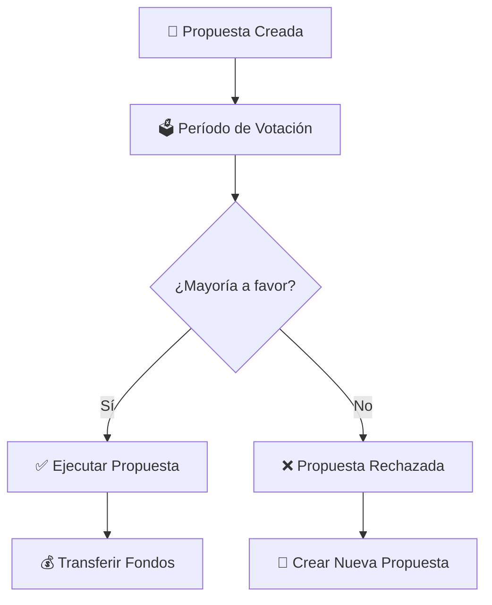

# 📝 Enviar Propuesta de Financiamiento - Tutorial Completo

> **Guía paso a paso para crear y enviar tu primera propuesta de financiamiento**

## 🎯 **¿Qué vamos a hacer?**

En este tutorial aprenderás a:
1. ✅ Preparar una propuesta de financiamiento bien estructurada
2. ✅ Enviar la propuesta a una DAO existente
3. ✅ Verificar que la propuesta fue creada correctamente
4. ✅ Consultar el estado y detalles de la propuesta
5. ✅ Entender el proceso de votación que sigue

**⏱️ Tiempo estimado:** 15-20 minutos  
**💰 Costo aproximado:** ~0.03 SUI en gas fees  
**📋 Prerequisito:** Tener una DAO existente (ver [`create-dao-updated.md`](create-dao-updated.md))

---

## 🔧 **Preparación**

### **1. Verificar Prerequisites**
```bash
# Verificar que tienes una DAO disponible
export DAO_ID="0x..."  # ID de DAO existente (del tutorial anterior)

# Verificar que la DAO existe y está activa
sui client object $DAO_ID

# Verificar balance suficiente
sui client balance
# Esperado: > 50000000 MIST (0.05 SUI)

# Package ID del contrato
export PACKAGE_ID="0x..."  # Package ID del deployment
```

### **2. Definir tu Propuesta**
```bash
# Información de la propuesta de ejemplo
export PROPOSAL_TITLE="Desarrollo de Dashboard DAO"
export PROPOSAL_DESCRIPTION="Crear interfaz web para visualizar propuestas, votos y estadísticas de la DAO. Incluirá funcionalidades de votación en tiempo real y historial de decisiones."
export REQUESTED_AMOUNT=3000000000  # 3 SUI en unidades MIST
export YOUR_ADDRESS=$(sui client active-address)
```

### **3. Verificar Estado de la DAO**
```bash
# Consultar información actual de la DAO
sui client call \
  --package $PACKAGE_ID \
  --module dao \
  --function get_dao_info \
  --args $DAO_ID
```

**🔍 Debes verificar:**
- ✅ La DAO tiene fondos suficientes (≥ 3 SUI en este ejemplo)
- ✅ La DAO está activa (active: true)
- ✅ El proposal_count actual (se incrementará en 1)

---

## 📝 **Paso 1: Crear la Propuesta**

### **📋 Comando para Crear Propuesta**
```bash
sui client call \
  --package $PACKAGE_ID \
  --module dao \
  --function create_proposal \
  --args $DAO_ID "$PROPOSAL_TITLE" "$PROPOSAL_DESCRIPTION" $REQUESTED_AMOUNT \
  --gas-budget 15000000
```

### **🔍 Explicación del Comando**
- **`$DAO_ID`**: ID de la DAO donde enviamos la propuesta
- **`"$PROPOSAL_TITLE"`**: Título breve y descriptivo
- **`"$PROPOSAL_DESCRIPTION"`**: Descripción detallada del proyecto
- **`$REQUESTED_AMOUNT`**: Cantidad en MIST (1 SUI = 1,000,000,000 MIST)

### **📊 Output Esperado**
```bash
╭──────────────────────────────────────────────────────────────────────────────────────╮
│ Transaction Effects                                                                  │
├──────────────────────────────────────────────────────────────────────────────────────┤
│ Digest: 2cKmF5Lq9xBvN7R8tGzWqX3YhSaVzPqKjMpLc4vBnRaE                             │
│ Status: Success                                                                      │
│ Executed Epoch: 125                                                                 │
│ Gas Used: 3200000                                                                   │
│                                                                                      │
│ Created Objects                                                                      │
│  ┌──                                                                                │
│  │ ObjectID: 0xproposal123...def456                                                │
│  │ Sender: 0x123...abc                                                             │
│  │ Owner: Shared                                                                    │
│  │ ObjectType: 0x...::dao::Proposal                                                │
│  │ Version: 1                                                                       │
│  │ Digest: abc123...                                                               │
│  └──                                                                                │
│                                                                                      │
│ Mutated Objects                                                                      │
│  ┌──                                                                                │
│  │ ObjectID: 0xabc123...def789    [DAO incrementa proposal_count]                  │
│  │ Owner: Shared                                                                    │
│  │ ObjectType: 0x...::dao::DAO                                                     │
│  │ Version: 3                                                                       │
│  └──                                                                                │
│                                                                                      │
│ Events                                                                               │
│  ┌──                                                                                │
│  │ PackageID: 0x...                                                                │
│  │ Transaction Module: dao                                                          │
│  │ Sender: 0x123...abc                                                             │
│  │ EventType: 0x...::dao::ProposalCreated                                          │
│  │ ParsedJSON:                                                                      │
│  │   ┌─────────────────────────────────────────────────────────────────────────   │
│  │   │ {                                                                           │
│  │   │   "amount_requested": "3000000000",                                         │
│  │   │   "dao_id": "0xabc123...def789",                                            │
│  │   │   "proposal_id": "0xproposal123...def456",                                  │
│  │   │   "proposer": "0x123...abc",                                                │
│  │   │   "title": "Desarrollo de Dashboard DAO"                                    │
│  │   │ }                                                                           │
│  │   └─────────────────────────────────────────────────────────────────────────   │
│  │ └──                                                                             │
╰──────────────────────────────────────────────────────────────────────────────────────╯
```

### **💾 Guardar Proposal ID**
```bash
# IMPORTANTE: Guardar el Object ID de la propuesta
export PROPOSAL_ID="0xproposal123...def456"  # Reemplazar con el ID real
echo "Propuesta creada con ID: $PROPOSAL_ID"
```

---

## 🔍 **Paso 2: Verificar la Propuesta**

### **📋 Consultar Información de la Propuesta**
```bash
sui client call \
  --package $PACKAGE_ID \
  --module dao \
  --function get_proposal_info \
  --args $PROPOSAL_ID
```

### **📊 Output Esperado de get_proposal_info**
```bash
╭──────────────────────────────────────────────────────────────────────────────────────╮
│ Return Values                                                                        │
├──────────────────────────────────────────────────────────────────────────────────────┤
│  ┌──                                                                                │
│  │ [0] "Desarrollo de Dashboard DAO"                                               │
│  │ [1] 3000000000                                                                  │
│  │ [2] 0x123...abc                                                                 │
│  │ [3] false                                                                       │
│  │ [4] 0                                                                           │
│  └──                                                                                │
╰──────────────────────────────────────────────────────────────────────────────────────╯
```

### **🔍 Interpretación de los Valores**
- **[0]**: Título de la propuesta
- **[1]**: Cantidad solicitada (3,000,000,000 MIST = 3 SUI)
- **[2]**: Address del proposer (tú)
- **[3]**: Ejecutado (false = no ejecutado aún)
- **[4]**: Status (0 = PROPOSAL_ACTIVE)

### **📋 Consultar Votos Actuales**
```bash
sui client call \
  --package $PACKAGE_ID \
  --module dao \
  --function get_proposal_votes \
  --args $PROPOSAL_ID
```

**Debería mostrar:** `[0] 0` y `[1] 0` (0 votos a favor, 0 votos en contra)

---

## 🗳️ **Paso 3: Estado de Votación**

### **📋 Verificar si Puede Ejecutarse**
```bash
sui client call \
  --package $PACKAGE_ID \
  --module dao \
  --function can_execute \
  --args $PROPOSAL_ID
```

**Resultado esperado:** `false` (no se puede ejecutar sin votos)

### **📋 Ver Propuesta Completa**
```bash
# Ver objeto completo de la propuesta
sui client object $PROPOSAL_ID --json
```

---

## 📊 **Paso 4: Análisis de la Propuesta Creada**

### **✅ Checklist de Verificación**

1. **✅ Propuesta Creada**
   - Object ID válido y consultable
   - Tipo: `dao::Proposal`
   - Owner: Shared

2. **✅ Información Correcta**
   - Título matches lo enviado
   - Descripción completa
   - Cantidad correcta (3 SUI)

3. **✅ Estado Inicial Correcto**
   - Status: 0 (PROPOSAL_ACTIVE)
   - Executed: false
   - Votes for: 0
   - Votes against: 0

4. **✅ Asociada a la DAO**
   - dao_id matches nuestro DAO_ID
   - DAO proposal_count incrementado

### **📈 Estado Actual**
```bash
echo "=== RESUMEN DE TU PROPUESTA ==="
echo "Propuesta ID: $PROPOSAL_ID"
echo "DAO ID: $DAO_ID"
echo "Título: $PROPOSAL_TITLE"
echo "Cantidad: $REQUESTED_AMOUNT MIST ($(($REQUESTED_AMOUNT / 1000000000)) SUI)"
echo "Proposer: $YOUR_ADDRESS"
echo "Estado: Activa y esperando votos"
```

---

## 🎯 **Próximos Pasos: Proceso de Votación**

### **🗳️ Para que tu propuesta sea aprobada necesitas:**

1. **👥 Votos de la Comunidad**
   - Los miembros con tokens de gobernanza pueden votar
   - Necesitas más votos A FAVOR que EN CONTRA
   - Cada token tiene un peso de voto específico

2. **⚡ Ejecución de la Propuesta**
   - Una vez aprobada, cualquiera puede ejecutarla
   - Los fondos se transfieren automáticamente al proposer
   - La propuesta se marca como ejecutada

3. **💰 Recepción de Fondos**
   - Si es aprobada y ejecutada, recibirás los 3 SUI
   - Los fondos vienen del tesoro de la DAO
   - La transacción es transparente y pública

### **🔄 Flujo Completo de Votación**


---

## 🛠️ **Comandos de Utilidad**

### **📊 Monitorear tu Propuesta**
```bash
# Script para verificar estado completo
check_proposal_status() {
    echo "=== ESTADO DE LA PROPUESTA ==="
    echo "Información básica:"
    sui client call --package $PACKAGE_ID --module dao --function get_proposal_info --args $PROPOSAL_ID
    
    echo "Votos actuales:"
    sui client call --package $PACKAGE_ID --module dao --function get_proposal_votes --args $PROPOSAL_ID
    
    echo "¿Puede ejecutarse?"
    sui client call --package $PACKAGE_ID --module dao --function can_execute --args $PROPOSAL_ID
}

# Usar el script
check_proposal_status
```

### **👀 Ver Todas las Propuestas de la DAO**
```bash
# Ver objetos de tipo Proposal
sui client objects --filter StructType:$PACKAGE_ID::dao::Proposal
```

### **🔔 Notificar a la Comunidad**
```bash
echo "🚨 NUEVA PROPUESTA PARA VOTAR 🚨"
echo "Título: $PROPOSAL_TITLE"
echo "Cantidad: $(($REQUESTED_AMOUNT / 1000000000)) SUI"
echo "ID: $PROPOSAL_ID"
echo "Descripción: $PROPOSAL_DESCRIPTION"
echo ""
echo "Para votar, los miembros deben usar sus tokens de gobernanza."
echo "Comando de ejemplo para votar SÍ:"
echo "sui client call --package $PACKAGE_ID --module dao --function cast_vote --args $PROPOSAL_ID [TOKEN_ID] true"
```

---

## ⚠️ **Troubleshooting**

### **❌ "DAO not active"**
```bash
# Verificar si la DAO está pausada
sui client call --package $PACKAGE_ID --module dao --function get_dao_info --args $DAO_ID
# Si active = false, la DAO está pausada
```

### **❌ "Invalid amount"**
```bash
# El monto debe ser > 0
export REQUESTED_AMOUNT=1000000000  # Mínimo 1 SUI
```

### **❌ "Insufficient funds in DAO"**
```bash
# Verificar fondos disponibles en la DAO
sui client call --package $PACKAGE_ID --module dao --function get_dao_info --args $DAO_ID
# treasury_balance debe ser >= requested_amount
```

### **❌ "String too long"**
```bash
# Reducir longitud del título o descripción
export PROPOSAL_TITLE="Dashboard DAO"
export PROPOSAL_DESCRIPTION="Crear interfaz web para la DAO"
```

---

## 📚 **Recursos Adicionales**

- **🗳️ Tutorial de votación**: [`voting-tutorial.md`](voting-tutorial.md) (próximamente)
- **⚡ Tutorial de ejecución**: [`execute-proposal.md`](execute-proposal.md) (próximamente)
- **📖 Documentación del contrato**: [`../docs/esplicacion-dao.md`](../docs/esplicacion-dao.md)
- **🧪 Ver tests de propuestas**: [`../contracts/tests/dao_tests.move`](../contracts/tests/dao_tests.move)

---

## 🎉 **¡Felicitaciones!**

### **✅ Has completado exitosamente:**
- ✅ Creación de una propuesta bien estructurada
- ✅ Envío a la DAO con toda la información necesaria
- ✅ Verificación de que todo funciona correctamente
- ✅ Configuración para el proceso de votación

### **🚀 Tu propuesta está ahora:**
- 📝 **Visible** para todos los miembros de la DAO
- 🗳️ **Lista** para recibir votos
- ⚡ **Preparada** para ejecución automática si es aprobada
- 🔍 **Auditable** y transparente en la blockchain

---

**🎊 ¡Excelente trabajo! Tu propuesta está en el sistema y lista para el proceso democrático de votación. Los miembros de la DAO pueden ahora evaluar y votar sobre tu proyecto.**
