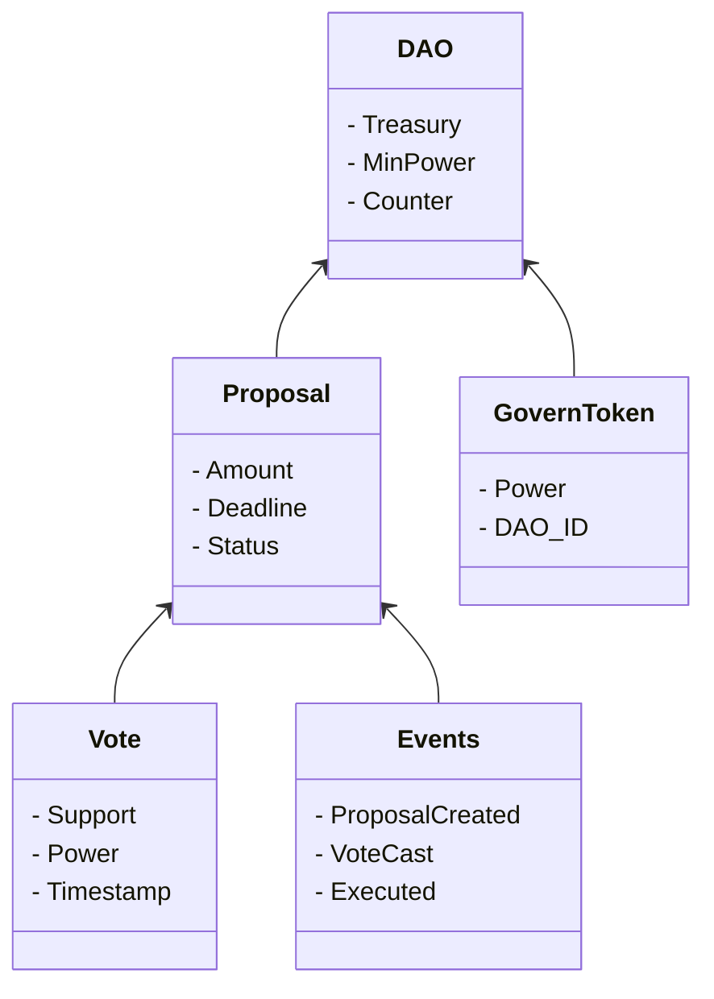

# 🏗️ Día 3: Arquitectura Completa de la DAO

> **Fecha:** 3 de Septiembre 2024  
> **Duración:** 3 horas  
> **Objetivo:** Diseñar la arquitectura completa y flujos de nuestra DAO

## 🎯 Lo que diseñaremos hoy

- ✅ Arquitectura general del sistema
- ✅ Flujos de interacción completos
- ✅ Estados y transiciones
- ✅ Validaciones y seguridad
- ✅ Casos edge y manejo de errores

---

## 🏛️ 1. ARQUITECTURA GENERAL

### 🎨 Diagrama de componentes:

```
                    🌍 SUI BLOCKCHAIN
    
    ┌─────────────────────────────────────────────────────────────┐
    │                     NUESTRA DAO                             │
    │                                                             │
    │  ┌─────────────┐    ┌─────────────┐    ┌─────────────┐      │
    │  │    DAO      │◄───┤  Proposal   │◄───┤    Vote     │      │
    │  │  (Shared)   │    │  (Shared)   │    │ (Dynamic)   │      │
    │  │             │    │             │    │             │      │
    │  │ • Treasury  │    │ • Amount    │    │ • Support   │      │
    │  │ • MinPower  │    │ • Deadline  │    │ • Power     │      │
    │  │ • Counter   │    │ • Status    │    │ • Timestamp │      │
    │  └─────────────┘    └─────────────┘    └─────────────┘      │
    │         ▲                   ▲                               │
    │         │                   │                               │
    │  ┌─────────────┐    ┌────────────────────┐                  │
    │  │GovernToken  │    │   Events           │                  │
    │  │  (Owned)    │    │ (Emitted)          │                  │
    │  │             │    │                    │                  │
    │  │ • Power     │    │ • ProposalCreated  │                  │
    │  │ • DAO_ID    │    │ • VoteCast         │                  │
    │  └─────────────┘    │ • Executed         │                  │
    │                     └────────────────────┘                  │
    └─────────────────────────────────────────────────────────────┘
    
    ┌─────────────────────────────────────────────────────────────┐
    │                     USUARIOS                                │
    │                                                             │
    │  👤 Creator      👤 Token Holder  👤 Proposer   👤 Voter  │
    │   └─ Creates DAO  └─ Votes          └─ Proposes   └─ Votes  │
    └─────────────────────────────────────────────────────────────┘
```

#### 📚 NUESTRA DAO


 
#### 👥 USUARIOS

```mermaid
flowchart LR
    subgraph USUARIOS
        Creator["👤 Creator</br>└─ Creates DAO"]
        TokenHolder["👤 Token Holder
        └─ Votes"]
        Proposer["👤 Proposer
        └─ Proposes"]
        Voter["👤 Voter
        └─ Votes"]
    end
```



## 🔄 2. FLUJOS COMPLETOS DE INTERACCIÓN

### 📋 **Flujo 1: Crear DAO**


### 🎫 **Flujo 2: Distribuir Tokens de Gobernanza**


### 📝 **Flujo 3: Crear Propuesta**


### 🗳️ **Flujo 4: Votar en Propuesta**


### ⚡ **Flujo 5: Ejecutar Propuesta**

```mermaid
sequenceDiagram
    participant U as Usuario
    participant B as Blockchain
    participant P as Propuesta
    participant D as DAO
    
    U->>B: execute_proposal(dao, proposal)
    B->>P: check_deadline_passed()
    B->>P: count_all_votes()
    B->>B: assert!(votes_for > votes_against)
    B->>D: balance::split(treasury, amount)
    B->>U: coin::from_balance(amount) → transfer
    B->>P: proposal.executed = true
    B->>B: emit!(ProposalExecuted{...})
    Note over P: Estado: Executed, Fondos transferidos
```



---

## 🎯 3. ESTADOS Y TRANSICIONES

### 📊 **Estados de la DAO:**
```move
// Estados implícitos por campos
struct DAO {
    active: bool,           // true = activa, false = pausada
    treasury: Balance<SUI>, // 0 = sin fondos, >0 = con fondos
    proposal_count: u64,    // contador incremental
}

const DAO_ACTIVE: u8 = 0;
const DAO_PAUSED: u8 = 1;
const DAO_TERMINATED: u8 = 2;
```

### 📝 **Estados de Propuestas:**
```move
// Estados explícitos
const PROPOSAL_ACTIVE: u8 = 0;      // Recibiendo votos
const PROPOSAL_APPROVED: u8 = 1;    // Ganó votación
const PROPOSAL_REJECTED: u8 = 2;    // Perdió votación  
const PROPOSAL_EXECUTED: u8 = 3;    // Fondos distribuidos
const PROPOSAL_EXPIRED: u8 = 4;     // Deadline pasó sin ejecución

struct Proposal {
    status: u8,           // Estado actual
    deadline: u64,        // Timestamp límite
    executed: bool,       // Si ya se ejecutó
}
```

### 🔄 **Transiciones de Estado:**

```
PROPOSAL LIFECYCLE:
                                    
    ACTIVE ──────┐
       │         │
       │         ▼
       │     EXPIRED
       │         
       ▼         
   APPROVED ────► EXECUTED
       │
       ▼
   REJECTED
```

---

## 🛡️ 4. VALIDACIONES Y SEGURIDAD

### 🔒 **Validaciones Críticas:**

```move
// === VALIDACIONES DE VOTACIÓN ===

public fun cast_vote(
    proposal: &mut Proposal,
    token: &GovernanceToken,  
    support: bool,
    ctx: &mut TxContext
) {
    let voter = tx_context::sender(ctx);
    
    // 1. Verificar que la propuesta esté activa
    assert!(proposal.status == PROPOSAL_ACTIVE, E_PROPOSAL_NOT_ACTIVE);
    
    // 2. Verificar que no haya expirado
    // TODO: assert!(current_time() < proposal.deadline, E_PROPOSAL_EXPIRED);
    
    // 3. Verificar que el token pertenezca a la misma DAO
    assert!(token.dao_id == proposal.dao_id, E_WRONG_DAO_TOKEN);
    
    // 4. Verificar que el usuario no haya votado antes
    assert!(!ofield::exists_(&proposal.id, voter), E_ALREADY_VOTED);
    
    // 5. Verificar poder de voto mínimo
    // TODO: assert!(token.voting_power >= dao.min_voting_power, E_INSUFFICIENT_POWER);
    
    // Solo entonces crear y agregar voto...
}

// === VALIDACIONES DE EJECUCIÓN ===

public fun execute_proposal(
    dao: &mut DAO,
    proposal: &mut Proposal,
    ctx: &mut TxContext
) {
    // 1. Solo se puede ejecutar una vez
    assert!(!proposal.executed, E_ALREADY_EXECUTED);
    
    // 2. Deadline debe haber pasado
    // TODO: assert!(current_time() > proposal.deadline, E_VOTING_STILL_ACTIVE);
    
    // 3. Debe haber suficientes fondos
    assert!(balance::value(&dao.treasury) >= proposal.amount_requested, E_INSUFFICIENT_FUNDS);
    
    // 4. Debe haber ganado la votación
    let (votes_for, votes_against) = count_all_votes(proposal);
    assert!(votes_for > votes_against, E_PROPOSAL_REJECTED);
    
    // 5. Debe haber quórum mínimo
    let total_votes = votes_for + votes_against;
    // TODO: assert!(total_votes >= dao.min_quorum, E_INSUFFICIENT_QUORUM);
    
    // Solo entonces transferir fondos...
}
```

### 🚨 **Códigos de Error:**
```move
// === CÓDIGOS DE ERROR ===
const E_PROPOSAL_NOT_ACTIVE: u64 = 0;
const E_PROPOSAL_EXPIRED: u64 = 1;
const E_WRONG_DAO_TOKEN: u64 = 2;
const E_ALREADY_VOTED: u64 = 3;
const E_INSUFFICIENT_POWER: u64 = 4;
const E_ALREADY_EXECUTED: u64 = 5;
const E_VOTING_STILL_ACTIVE: u64 = 6;
const E_INSUFFICIENT_FUNDS: u64 = 7;
const E_PROPOSAL_REJECTED: u64 = 8;
const E_INSUFFICIENT_QUORUM: u64 = 9;
const E_UNAUTHORIZED: u64 = 10;
```

---

## ⚖️ 5. FUNCIONES DE UTILIDAD Y CONSULTA

### 🔍 **Funciones de Consulta:**

```move
// === CONTEO DE VOTOS ===

// Contar todos los votos de una propuesta
public fun count_all_votes(proposal: &Proposal): (u64, u64) {
    // TODO: Implementar iteración sobre dynamic fields
    // Por ahora, mantener contadores en la propuesta
    (proposal.votes_for, proposal.votes_against)
}

// Verificar si propuesta puede ejecutarse
public fun can_execute(proposal: &Proposal): bool {
    let (votes_for, votes_against) = count_all_votes(proposal);
    votes_for > votes_against && !proposal.executed
}

// Obtener estado actual de propuesta
public fun get_proposal_status(proposal: &Proposal): u8 {
    if (proposal.executed) {
        PROPOSAL_EXECUTED
    } else {
        // TODO: Verificar deadline
        proposal.status
    }
}

// === FUNCIONES DE ADMIN ===

// Pausar DAO (solo owner/admin)
public fun pause_dao(dao: &mut DAO, _admin_cap: &AdminCap) {
    dao.active = false;
}

// Financiar DAO
public fun fund_dao(dao: &mut DAO, payment: Coin<SUI>) {
    let balance = coin::into_balance(payment);
    balance::join(&mut dao.treasury, balance);
}

// Consultar fondos disponibles
public fun get_treasury_balance(dao: &DAO): u64 {
    balance::value(&dao.treasury)
}
```

---

## 🎭 6. EVENTOS PARA TRANSPARENCIA

```move
// === EVENTOS PARA LOGGING ===

struct DAOCreated has copy, drop {
    dao_id: ID,
    name: String,
    creator: address,
    timestamp: u64,
}

struct ProposalCreated has copy, drop {
    proposal_id: ID,
    dao_id: ID,
    title: String,
    amount: u64,
    proposer: address,
    deadline: u64,
}

struct VoteCast has copy, drop {
    proposal_id: ID,
    voter: address,
    support: bool,
    voting_power: u64,
    timestamp: u64,
}

struct ProposalExecuted has copy, drop {
    proposal_id: ID,
    dao_id: ID,
    recipient: address,
    amount: u64,
    votes_for: u64,
    votes_against: u64,
}

// Emitir eventos en funciones:
public fun create_proposal(...) {
    // ... lógica ...
    
    event::emit(ProposalCreated {
        proposal_id: object::id(&proposal),
        dao_id: object::id(dao),
        title: proposal.title,
        amount: proposal.amount_requested,
        proposer: tx_context::sender(ctx),
        deadline: proposal.deadline,
    });
}
```

---

## 🤔 DECISIONES DE DISEÑO

### ✅ **Lo que decidimos:**

1. **Objetos Compartidos:** DAO y Propuestas son `shared` para colaboración
2. **Dynamic Fields:** Votos se almacenan como campos dinámicos por eficiencia
3. **Referencias ID:** Conectamos objetos con ID en lugar de ownership
4. **Estados Explícitos:** Enums claros para estados de propuestas
5. **Validaciones Estrictas:** Múltiples verificaciones en cada función crítica
6. **Eventos Completos:** Logging detallado para transparencia

### 🤷 **Alternativas que consideramos:**

- **Tabla vs Dynamic Fields:** Elegimos dynamic fields por menor overhead
- **Owned vs Shared Proposals:** Elegimos shared para votación colaborativa  
- **Contadores vs Iteración:** Elegimos contadores por eficiencia de gas
- **Admin Cap vs Address:** Elegimos address por simplicidad inicial

---

## 🧪 7. CASOS EDGE Y TESTING

### 🚨 **Casos Edge a Testear:**

1. **Votar después de deadline**
2. **Ejecutar propuesta sin fondos suficientes**  
3. **Votar con token de otra DAO**
4. **Ejecutar propuesta ya ejecutada**
5. **Crear propuesta con amount = 0**
6. **Votar sin tener tokens**
7. **Propuesta sin votos (empate 0-0)**

### 🧪 **Plan de Testing:**
```move
#[test_only]
module dao_financing::dao_tests {
    use dao_financing::dao;
    
    #[test]
    fun test_create_dao_success() {
        // Test básico de creación
    }
    
    #[test]
    #[expected_failure(abort_code = E_ALREADY_VOTED)]
    fun test_double_vote_fails() {
        // Test votar dos veces falla
    }
    
    #[test]  
    #[expected_failure(abort_code = E_INSUFFICIENT_FUNDS)]
    fun test_execute_without_funds_fails() {
        // Test ejecutar sin fondos falla
    }
}
```

---

## ✅ RESUMEN DEL DÍA

**Lo que diseñamos:**
- ✅ Arquitectura completa con todos los componentes
- ✅ Flujos detallados de cada interacción
- ✅ Estados y transiciones claras  
- ✅ Validaciones de seguridad estrictas
- ✅ Sistema de eventos para transparencia
- ✅ Casos edge y plan de testing

**Decisiones arquitectónicas clave:**
- Objetos shared para colaboración
- Dynamic fields para votos variables
- Referencias ID para conectar objetos
- Estados explícitos para clarity
- Validaciones múltiples para seguridad

**Lo que queda por implementar:**
- [ ] Manejo de tiempo real (Clock)
- [ ] Iteración sobre dynamic fields
- [ ] Sistema de quórum avanzado
- [ ] Admin capabilities
- [ ] Optimización de gas

---

## 🎯 PRÓXIMOS PASOS

1. **Implementar funciones básicas** con la arquitectura diseñada
2. **Agregar manejo de tiempo** con Clock de Sui
3. **Crear tests completos** para todos los casos edge
4. **Optimizar gas** en operaciones costosas
5. **Documentar APIs** para usuarios finales

---

## 📝 NOTAS PERSONALES

- La arquitectura está bien balanceada entre simplicidad y funcionalidad
- Dynamic fields son perfectos para votos, pero necesitamos función de conteo
- Las validaciones son críticas - mejor prevenir que lamentar
- Los eventos harán la DAO completamente transparente
- Los casos edge van a ser interesantes de implementar

**Tiempo invertido:** 3 horas  
**Dificultad:** ⭐⭐⭐⭐⚪ (4/5)  
**Siguiente sesión:** Implementación práctica del código